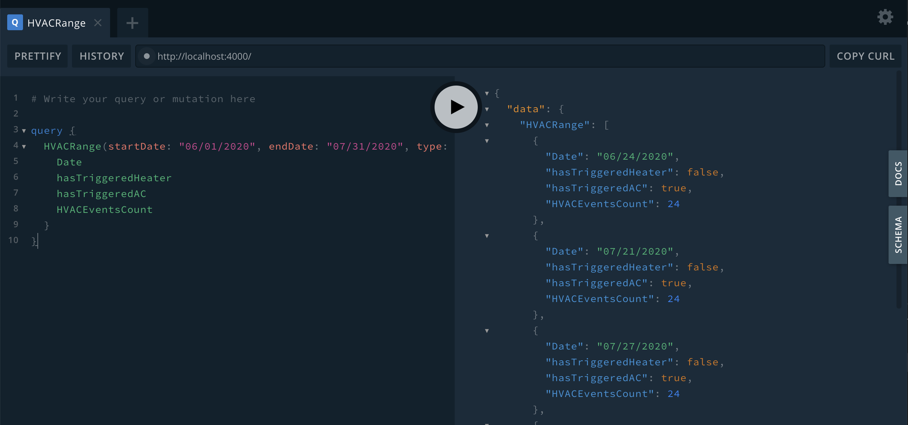
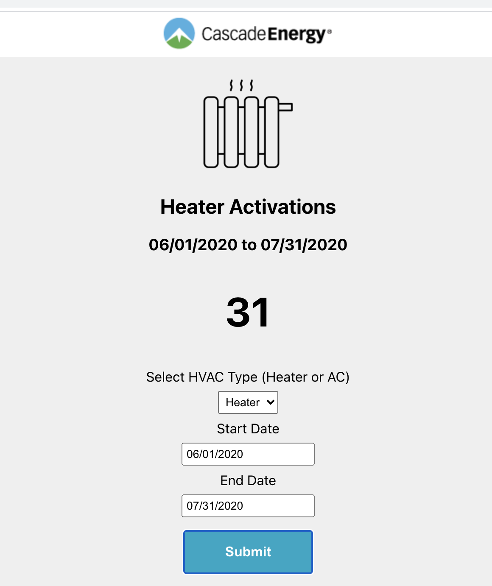

## Cascade GraphQl Api Project in Progress

Technology used:

- GraphQl / Apollo Server
- MongoDb
- React / Modal / Grid / Chart
- Docker / Docker Compose

# Run Locally

## Step 1 Run Mongo in Docker Container

Change into mongo directory
**mongo**
Run this command.

```
docker-compose build --no-cache
```

And then run this command:

```
docker-compose u
```

This will launch and run the mongo database--creating shared folders in the **mongo** directory. This is how the data is persisted on subsequent runs.

## Step 2 Populate MongoDb

### Populate the mongo database

Change directories into **apollo-server**
Run the following command to install node_modules

```
npm install
```

After modules are installed run this command:

```
npm run loadData
```

This will load data into mongo db through mongoose. You should see a success message. Terminate the process. (This is klunky, I know--I had big issues trying to use docker to load the data. I am actively learning more about Docker so I can fix this issue.)

## Step 3 Run Apollo / Play with Queries

With mongo running. Change directories into **apollo-server**
**apollo-server**

```
npm run serve
```

This will launch apollo server. There should be a success message in the console.

You can use the apollo query tool to view results:
http://localhost:4000



A few queries to try:

The query below shows results for AC events. You can add or remove fields. For instance, you can remove **hasTriggeredHeater** as a result, that field will not be present in the json response. Other avialable fields should auto suggest.

```
   query {
        HVACRange(startDate: "06/01/2020", endDate: "07/31/2020", type: "AC"){
          Date
          hasTriggeredHeater
          hasTriggeredAC
          HVACEventsCount
        }
      }
```

## Step 4 Run Client



With apollo and mongo running, change directories into **client**
**client**
Run the following command to install node_modules

```
npm install
```

After installing node_modules, run this command

```
npm start
```

The client will launch here:
http://localhost:3000

## Stopping Docker

To stop mongo, terminate the process in the terminal.
Then use this command:

```
docker-compose down --remove-orphans
```

When you are ready to run the project again, you restart mongo:

```
docker-compose up
```

If you did NOT delete the **mongo** and **mongo.docker** the data from the previous run should remain.

Todo:

- Tests
- Improve data seeding
- CI/CD process
- UI (I rushed though UI, there is much to be improved--but the core features are present)

* SECURITY-- I would NEVER include .env with senstive information in git. However, the .env filed in the project are needed to run locally--I did not want.
